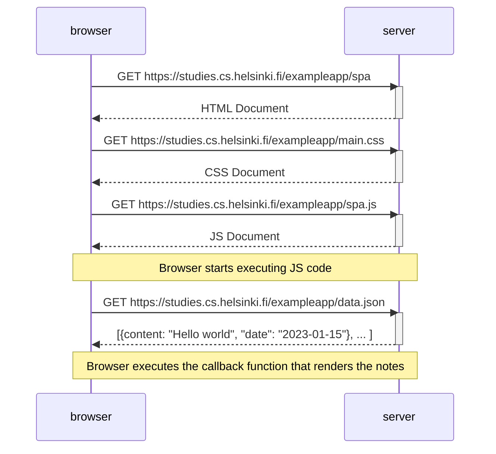

```mermaid
sequenceDiagram
	participant browser
	participant server
	browser ->> server: GET https://studies.cs.helsinki.fi/exampleapp/spa
	activate server
	server -->> browser: HTML Document
	deactivate server

	browser ->> server: GET https://studies.cs.helsinki.fi/exampleapp/main.css
	activate server
	server -->> browser: CSS Document
	deactivate server

	browser ->> server: GET https://studies.cs.helsinki.fi/exampleapp/spa.js
	activate server
	server -->> browser: JS Document
	deactivate server

	Note over browser, server: Browser starts executing JS code

	browser ->> server: GET https://studies.cs.helsinki.fi/exampleapp/data.json
	activate server
	server -->> browser: [{content: "Hello world", "date": "2023-01-15"}, ... ]
	deactivate server

	Note over browser, server: Browser executes the callback function that renders the notes
```